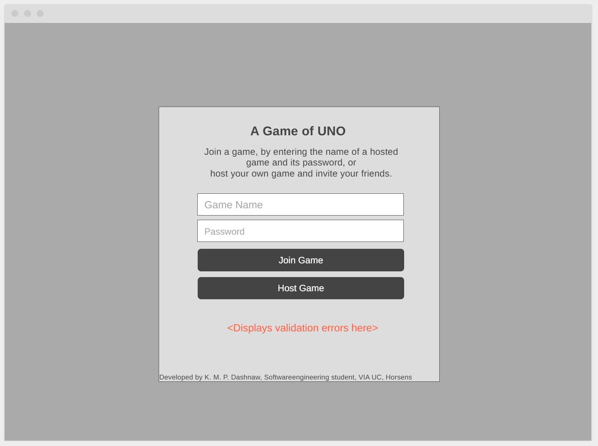
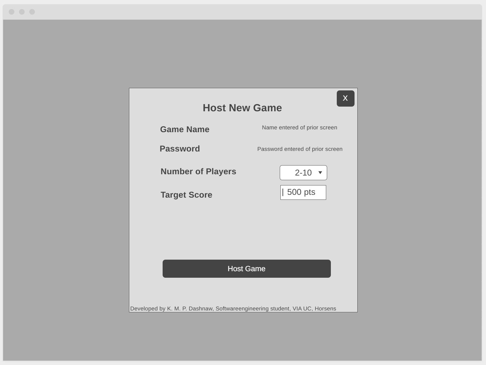
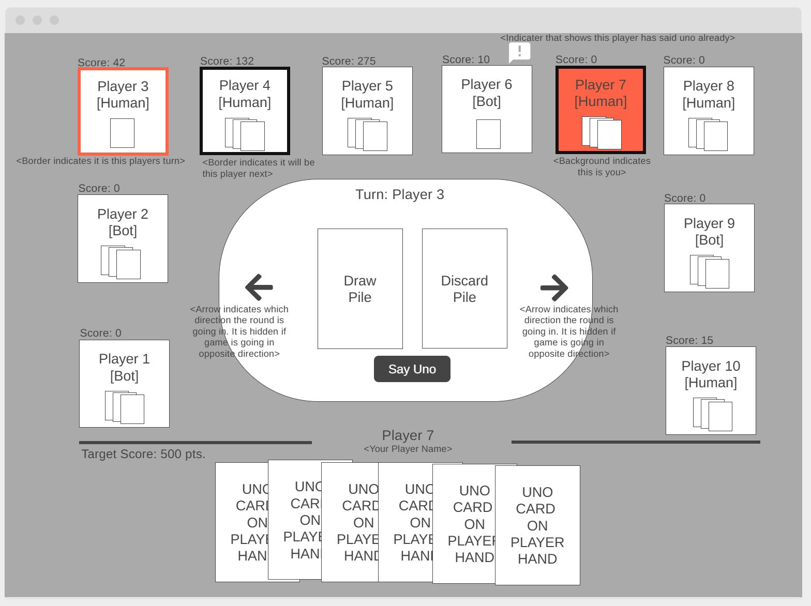
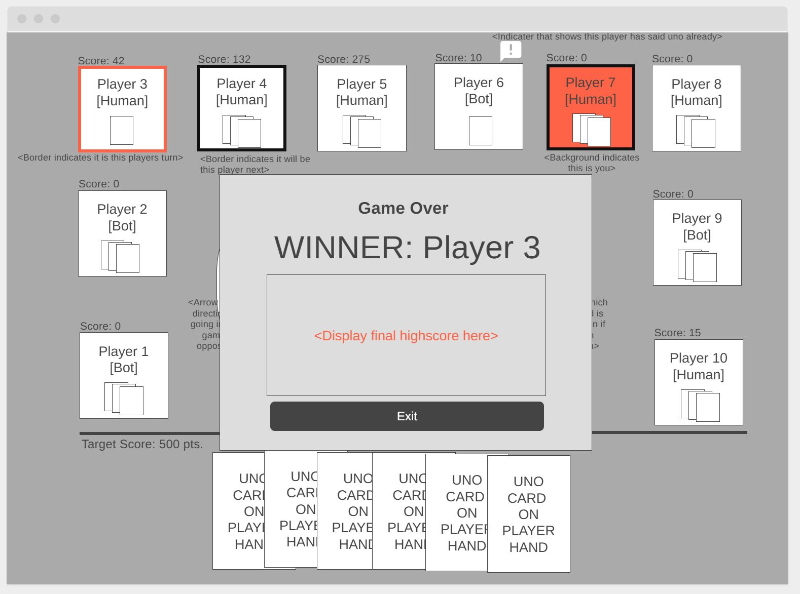

# UI Wireframe concepts

## Welcome Screen:

Link: https://wireframe.cc/K9zWWc

## Host New Game

Link: https://wireframe.cc/ak5K3b

## Playing a game

Link: https://wireframe.cc/7GCDuA

## Ending a round

Link: https://wireframe.cc/D0HsSF

## Ending a game

Link: https://wireframe.cc/JMwI7q